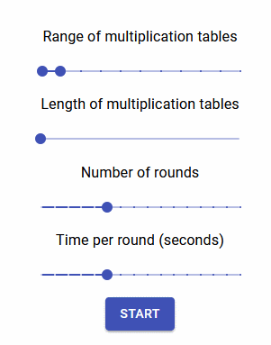

# multiplication-tables-exercise-react

A utility to practise / memorize multiplication tables made with ReactJS.

To check out the project...

> Clone / Download zip

> run "npm install" (will require node and npm)

> run "npm start"

Feedback is appreciated. Thank you!
